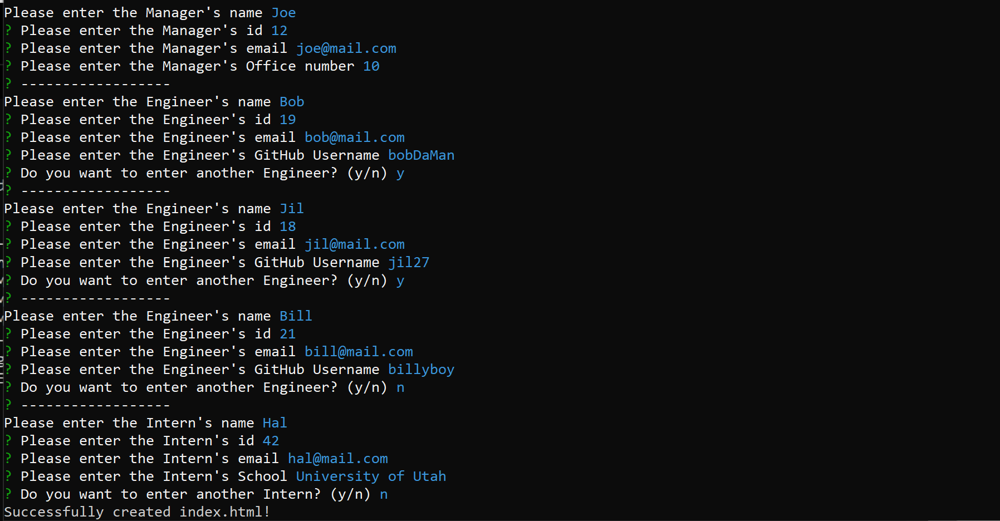

# Project Team Builder

## Description

Welcome to Project Team Builder! Project Team Builder is a CLI application designed to easily create a project team webpage through [Inquirer](https://www.npmjs.com/package/inquirer). Project Team Builder streamlines team webpage creation to help both large and small business waist less time on creating them.

## Table of Contents
 - [Usage](#usage)
 - [Credits](#credits)
 - [License](#license)
 - [Questions](#questions)

## Usage

[how-to-project-team-builder.webm](https://user-images.githubusercontent.com/115580058/222594235-2eeac614-fad0-4211-b0b8-45c23250f4f9.webm)

To use the appliation, you start by opening a terminal in the directory of the application. Type in "npm start" and the application will give you a series of prompts which will guide you through creating a team.

## Credits

Creator: Gustavo Carrillo

## License

This project is under the MIT License

## Questions
     
Please contact me using the following:

 - [GitHub Profile](https://github.com/0zrk23/)
 - [Email](gus.carrillo1221@gmail.com)
